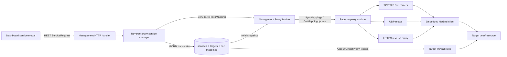

# Multi-port reverse-proxy architecture

This document records the reverse-proxy architecture before implementing
[netbirdio/netbird#5821](https://github.com/netbirdio/netbird/issues/5821).
It describes the NetBird repository at `8e02154bf` and the separately maintained
dashboard repository at `58d1035`.

## Component map

The feature crosses four processes and two repositories:

1. The dashboard sends a REST `ServiceRequest` to management.
2. Management validates it and persists a `service.Service` plus its associated
   `service.Target` rows.
3. Management converts the service to a protobuf `ProxyMapping` and sends it to
   the reverse-proxy process over the `ProxyService` gRPC stream.
4. While constructing peer network maps, management injects an in-memory policy
   allowing the embedded proxy peer to reach each target protocol and port.
5. The reverse proxy creates an embedded NetBird client for the account, then
   installs an HTTP route, TCP/TLS route, or UDP relay which dials the target
   through that embedded client.



## Management data model and persistence

### Service

The authoritative model is
`management/internals/modules/reverseproxy/service.Service` in
`management/internals/modules/reverseproxy/service/service.go`.

Important fields are:

| Concern | Field | Current meaning |
| --- | --- | --- |
| identity | `Service.ID` | Stable service ID and GORM primary key |
| tenant | `Service.AccountID` | Owning NetBird account |
| hostname | `Service.Domain` | Public hostname; globally unique through `gorm:"uniqueIndex"` |
| proxy placement | `Service.ProxyCluster` | Cluster address derived from the selected domain |
| frontend protocol | `Service.Mode` | Exactly one of `http`, `tcp`, `udp`, or `tls` |
| listener | `Service.ListenPort` | One frontend port for the whole L4 service |
| allocation | `Service.PortAutoAssigned` | Whether management chose `ListenPort` |
| backends | `Service.Targets` | Associated `Target` rows, cascade-deleted with the service |
| lifecycle | `Enabled`, `Terminated`, `Meta` | Distribution and status state |

GORM creates the `services` table. The schema has one scalar `mode` and one
scalar `listen_port`; there is no port-mapping table or serialized mapping
collection. `Domain` has a database unique index, so two persisted service rows
cannot intentionally share a hostname even if their ports or protocols differ.

The distinct `management/internals/modules/reverseproxy/domain.Domain` model in
`management/internals/modules/reverseproxy/domain/domain.go` represents an
available custom/free domain and its target cluster. It is not a service port
mapping. Its `Domain` is also globally unique. Capability fields such as
`SupportsCustomPorts` are query-time values and are not persisted.

### Target

`management/internals/modules/reverseproxy/service.Target` stores the upstream:

| Concern | Field | Current meaning |
| --- | --- | --- |
| owner | `AccountID`, `ServiceID` | Tenant and parent service |
| target peer/resource | `TargetId`, `TargetType` | Peer ID, network-resource ID, subnet, domain, or cluster |
| resolved destination | `Host` | Peer overlay IP or resource address; refreshed by `replaceHostByLookup` |
| destination port | `Port` | A single backend port |
| destination protocol | `Protocol` | `http`, `https`, `tcp`, or `udp` |
| HTTP routing | `Path` | URL prefix; rejected for L4 services |
| relay options | `Options`, `ProxyProtocol` | Timeouts, direct-upstream, headers, and PROXY protocol |

For a peer target, `TargetId` is the peer ID and `Host` is replaced with that
peer's current overlay IP before API responses and proxy distribution. A target
therefore stores both stable target identity and the presently resolved dial
address.

The SQL store implementation is in `management/server/store/sql_store.go`:

- `CreateService` inserts the service and associated targets.
- `GetServiceByID`, `GetServiceByDomain`, `GetServices`, and
  `GetAccountServices` preload `Targets`.
- `UpdateService` currently deletes every target row and saves the complete
  replacement service graph in one transaction.
- `DeleteService` relies on the association's cascade behavior.
- `GetServicesByClusterAndPort` supports manager-level conflict checks.

`management/server/store/sql_store.go` runs GORM `AutoMigrate` for `Service`,
`Target`, and `Domain`. Idempotent pre/post-auto migration hooks are assembled
in `management/server/store/store.go`. There is no general versioned up/down
schema migration framework; the `sqlite-migration` command concerns the old
JSON-to-SQLite store conversion, not arbitrary schema rollback.

## REST API creation and update path

The public contract is defined in
`shared/management/http/api/openapi.yml`. Generated Go models live in
`shared/management/http/api/types.gen.go`, and the repository REST client is
`shared/management/client/rest/reverse_proxy_services.go`.

The service endpoints are:

| Method | Endpoint | Handler action |
| --- | --- | --- |
| `GET` | `/api/reverse-proxies/services` | List account services |
| `POST` | `/api/reverse-proxies/services` | Create a service |
| `GET` | `/api/reverse-proxies/services/{serviceId}` | Read one service |
| `PUT` | `/api/reverse-proxies/services/{serviceId}` | Replace/update a service |
| `DELETE` | `/api/reverse-proxies/services/{serviceId}` | Delete a service |

They are registered by
`management/internals/modules/reverseproxy/service/manager/api.go`, which is
wired from `management/server/http/handler.go` when both the service and domain
managers are available. Create and update follow this path:

1. Decode `api.ServiceRequest`.
2. `Service.FromAPIRequest` copies `domain`, `mode`, scalar `listen_port`, and
   the target list into internal types. A target's scalar `port` becomes
   `Target.Port`.
3. `Service.Validate` performs protocol-specific validation.
4. `service/manager.Manager` checks permissions, resolves the cluster and target
   references, allocates/checks the L4 port, and persists the record.
5. The manager calls `Service.ToProtoMapping` and sends a create/modify mapping
   to the selected proxy cluster.

The OpenAPI request presently exposes one optional `listen_port` and a target
array. For L4 modes the array is not load-balancing data: backend validation
requires exactly one member.

`shared/management/http/api/generate.sh` regenerates the Go API types with
`oapi-codegen` v2.7.1.

## Dashboard creation and editing path

The administration UI is not stored in this repository. It is the separate
[`netbirdio/dashboard`](https://github.com/netbirdio/dashboard) repository, as
documented by this repository's `CONTRIBUTING.md`.

At dashboard commit `58d1035`, the relevant files are:

| File | Responsibility |
| --- | --- |
| `src/interfaces/ReverseProxy.ts` | Handwritten `ReverseProxy`, `ReverseProxyTarget`, mode, and protocol types |
| `src/app/(dashboard)/reverse-proxy/services/page.tsx` | Services page entry point |
| `src/modules/reverse-proxy/table/ReverseProxyTable.tsx` | Service list and modal entry |
| `src/modules/reverse-proxy/ReverseProxyModal.tsx` | Shared add/edit form and request-payload assembly |
| `src/modules/reverse-proxy/ReverseProxyLayer4Content.tsx` | The single L4 listen-port → destination-port row |
| `src/modules/reverse-proxy/ReverseProxyHTTPTargets.tsx` | Existing add/edit/remove list pattern for HTTP targets |
| `src/modules/reverse-proxy/targets/ReverseProxyTargetModal.tsx` | HTTP target editor |
| `src/contexts/ReverseProxiesProvider.tsx` | REST fetch/create/update/delete calls and cache mutation |

`ReverseProxiesProvider` calls `/reverse-proxies/services`; the shared API helper
adds the `/api` prefix. `ReverseProxyModal` maintains separate scalar state for
`serviceMode`, `listenPort`, destination `port`, and `l4Target`. On submit it
constructs one `l4TargetPayload` and deliberately sends
`targets: [l4TargetPayload]`. The L4 content component renders exactly one
listener and destination port input. HTTP targets already use a reusable list
with add/edit/remove actions, which is the closest existing UI convention for
the requested mapping editor.

## Proxy configuration generation and distribution

The management-to-proxy wire contract is
`shared/management/proto/proxy_service.proto`; generated Go files are beside it.
`shared/management/proto/generate.sh` runs `protoc`.

`Service.ToProtoMapping` in `service.go` emits one `proto.ProxyMapping` with:

- `id`, `account_id`, and `domain`;
- scalar `mode` and scalar `listen_port`;
- repeated `path` entries;
- auth, restrictions, and HTTP behavior.

`Service.buildPathMappings` uses the repeated `path` field differently by
mode. HTTP services produce one entry per URL path/target. L4 validation limits
the service to one target, and each L4 entry contains only the final
`host:destination-port` string. The frontend protocol and listener port remain
on the parent `ProxyMapping`. There is no wire type that binds an individual
frontend protocol/range to an individual destination port/range.

Management distribution is implemented in
`management/internals/shared/grpc/proxy.go`:

- On connection, `snapshotServiceMappings` loads enabled services for the
  proxy's account/cluster and converts each to a create mapping.
- New proxies use the bidirectional `ProxyService.SyncMappings` stream with
  batch acknowledgements.
- Older proxies can use the server-streaming `GetMappingUpdate` RPC.
- Incremental changes flow through
  `ProxyServiceServer.SendServiceUpdateToCluster` and each proxy's send queue.
- One-time embedded-peer authentication tokens are generated per proxy replica.
- Capability filtering keeps custom-port mappings away from proxies that did
  not report custom-port support; removals are always sent for cleanup.

The service manager initiates incremental notifications from
`management/internals/modules/reverseproxy/service/manager/manager.go` through
`management/internals/modules/reverseproxy/proxy/manager.GRPCController`.

## Listener and relay instantiation

Listener construction is concentrated in `proxy/server.go`, with TCP routing in
`proxy/internal/tcp/router.go`, UDP relay behavior in
`proxy/internal/udp/relay.go`, and HTTP forwarding in
`proxy/internal/proxy/reverseproxy.go`.

| Frontend | Where instantiated | Current routing behavior |
| --- | --- | --- |
| public HTTPS / HTTP-mode service | `Server.Start` calls `bindMainListener`, constructs `tcp.NewRouter`, and runs `http.Server.ServeTLS` over `mainRouter.HTTPListener()` | SNI selects an HTTP route, then host/path selects an HTTP or HTTPS backend target |
| ACME HTTP | `Server.configureTLS` calls `http.Server.ListenAndServe` on `ACMEChallengeAddress` for `http-01` | ACME challenge handler only; not the normal public service listener |
| private HTTP and HTTPS | `inboundManager.bringUp` in `proxy/inbound.go` opens embedded-netstack TCP ports 80 and 443 and runs parallel `Serve`/`ServeTLS` servers | NetBird-only HTTP services on an account-scoped tunnel listener |
| raw TCP | `setupTCPMapping` obtains `routerForPort`; `getOrCreatePortRouter` calls `net.Listen("tcp", :port)` and installs a fallback `tcp.Route` | One catch-all destination for that TCP port; hostname is logging/cluster metadata, not raw TCP routing input |
| TLS passthrough | `setupTLSMapping` obtains the main or a custom TCP router and calls `AddRoute(SNIHost(domain), route)` | Multiple hostnames may share a port because ClientHello SNI selects the destination |
| raw UDP | `setupUDPMapping` / `addUDPRelay` calls `net.ListenPacket("udp", :port)` and constructs `udp.Relay` | One relay/destination per bound UDP port; UDP has no hostname/SNI discriminator |

`Server.setupMappingRoutes` dispatches by the mapping's single `mode` to
`setupHTTPMapping`, `setupTCPMapping`, `setupUDPMapping`, or `setupTLSMapping`.
For L4, helpers such as `l4TargetAddress`, `l4ProxyProtocol`, and
`l4DialTimeout` read only `mapping.path[0]`.

TCP and UDP can already use the same numeric port at runtime because one is a
TCP socket and the other is a UDP socket. TLS passthrough and raw TCP can share
a TCP listener in the current router: SNI routes are checked first and the raw
TCP mapping is the fallback. Only one raw TCP fallback can own a given router.

The runtime tracks a service's custom TCP ports in
`Server.svcPorts map[ServiceID][]uint16`, although setup currently stores a
one-element slice. UDP relays are keyed only by `ServiceID`, so the current map
can hold only one UDP relay per service. Modify currently removes all old routes
for the service and reapplies the full mapping while retaining the embedded
NetBird peer; delete removes routes/relays and then the peer.

## Where the one-port limitation is enforced

The limitation is a combination of every layer except the socket primitives:

| Layer | Enforcement |
| --- | --- |
| database model/schema | `services.mode` and `services.listen_port` are scalar; `services.domain` is globally unique. There is nowhere to persist multiple mappings and separate services cannot share a domain. |
| API schema/conversion | `ServiceRequest` has one `mode` and one `listen_port`; each target has one destination `port`. |
| backend validation | `validateTCPUDPMode` and `validateTLSMode` require exactly one target. Manager conflict checks compare one `(proxy_cluster, mode, listen_port)`. |
| dashboard | L4 form holds one protocol mode, one listener port, one destination port, and one target, then emits a one-element target array. |
| protobuf wire format | `ProxyMapping` has one `mode` and one `listen_port`; the repeated `path` type has no per-entry listener mapping/range fields. |
| proxy runtime | Dispatch occurs once by mapping mode; L4 helpers read `path[0]`; setup installs one TCP/TLS route or UDP relay. UDP relay state is keyed one-per-service. |

The OS/runtime primitives do not fundamentally prevent the feature. The proxy
already creates arbitrary per-port TCP routers and UDP sockets on demand, and
`svcPorts` was shaped as a slice. The model and wire contract need to express
multiple mappings, and runtime ownership/cleanup must become mapping-aware.

## Existing conflict behavior

`service/manager.Manager.checkPortConflict` enforces conflicts in application
code, inside the create/update transaction:

- TCP and UDP are looked up by `(proxy_cluster, mode, listen_port)`, so equal
  numeric TCP and UDP ports are allowed.
- TLS services with different domains may share `(cluster, port)` because SNI
  disambiguates them.
- TLS versus raw TCP is intentionally allowed; the router uses the raw TCP
  route as fallback.
- `assignPort` is more conservative and treats every occupied scalar
  `ListenPort` in a cluster as unavailable, regardless of transport.
- There is no database unique constraint for listener ownership, so all writes
  must continue to pass through a transactional manager-level check.

## Domain semantics for raw L4 traffic

For HTTP and TLS passthrough, the domain is a real runtime routing key: HTTP uses
Host/SNI and TLS passthrough uses SNI. Raw TCP and UDP have no hostname on the
wire. For those modes the current domain is still required because management
derives `ProxyCluster` from it, the UI uses it as the service identity, TLS/DNS
configuration points clients at the proxy address, and logs include it. Once a
packet reaches a raw TCP/UDP port, however, routing is exclusively by transport
and listener port. A multi-port implementation should preserve that product
behavior and must not claim that UDP is selected by hostname.

## Implications for a compatible multi-port design

The smallest architecture-aligned extension is an ordered child collection of
L4 port mappings owned by one `Service`, while preserving `Mode`, `ListenPort`,
and the first L4 `Target` as legacy compatibility fields during transition.
Each mapping needs its own transport, listener start/end, target start/end, and
stable ordering (or stable child ID). Management must validate expanded
listener intervals across both the request and every other service in the same
cluster. The proxy wire should add repeated mapping entries rather than
overloading HTTP `PathMapping` semantics.

HTTP services and existing TLS-passthrough services should remain on their
current code path. In particular, changing the meaning of the existing
`ProxyMapping.mode`, `listen_port`, or `path` fields would break old proxies;
adding a capability and additive protobuf fields permits management to keep
serving legacy single-port mappings while only sending multi-port mappings to a
proxy that advertises support.

## Observed local baseline

The baseline was run on 2026-07-10 EDT (2026-07-11 UTC) against backend commit
`8e02154bf`, dashboard commit `58d1035`, and the local stack in `dev/local`.
`dev-source` and `dev-target` were independently enrolled with the locally
built client. Before involving the public proxy, direct overlay probes returned
`tcp:8080:overlay-tcp` and `udp:9001:overlay-udp` from `dev-target`.

`dev/local/baseline.sh` then created the following current-model records:

| Service domain | Service row | Target row |
| --- | --- | --- |
| `baseline-tcp-8080.proxy.netbird.test` | `mode=tcp`, `listen_port=18080` | `protocol=tcp`, `port=8080`, `target_id=<dev-target peer ID>` |
| `baseline-tcp-9000.proxy.netbird.test` | `mode=tcp`, `listen_port=19000` | `protocol=tcp`, `port=9000`, `target_id=<dev-target peer ID>` |
| `baseline-udp-9001.proxy.netbird.test` | `mode=udp`, `listen_port=19001` | `protocol=udp`, `port=9001`, `target_id=<dev-target peer ID>` |

The representative create request was:

```json
{
  "name": "baseline-tcp-8080",
  "domain": "baseline-tcp-8080.proxy.netbird.test",
  "mode": "tcp",
  "listen_port": 18080,
  "enabled": true,
  "targets": [
    {
      "target_id": "<dev-target peer ID>",
      "target_type": "peer",
      "protocol": "tcp",
      "port": 8080,
      "enabled": true
    }
  ]
}
```

The response has the same scalar mode/listener and one target. Management adds
the service ID, `proxy_cluster: "proxy.netbird.test"`, status metadata, and a
resolved `targets[0].host` containing the target's current overlay address. In
SQLite, the service occupies one `services` row and the upstream occupies one
`targets` row. The persisted peer target's `host` is empty; target lookup fills
the current overlay address only when management builds the API response or
proxy mapping.

Attempting another service with domain
`baseline-tcp-8080.proxy.netbird.test`, listener 20000, and target port 9000
returned HTTP 409:

```json
{
  "message": "domain already taken",
  "code": 409
}
```

Thus even a different, nonconflicting listener requires another service record
and another domain. After management distributed all three mappings, public
probes from `dev-source` traversed the host listener, reverse proxy, embedded
NetBird client, and target service and returned:

```text
TCP 18080 -> 8080: tcp:8080:baseline-public-8080
TCP 19000 -> 9000: tcp:9000:baseline-public-9000
UDP 19001 -> 9001: udp:9001:baseline-public-udp
```

Each run writes its exact request/response documents, `summary.json`, and a
read-only SQLite snapshot to `dev/local/.state/baseline` (ignored by Git).

## Implemented additive design

The implementation keeps the baseline description above as the historical
one-port model and adds the following pieces:

- `service.PortMapping` is an ordered GORM child of `service.Service`, stored
  in `service_port_mappings`. It owns `protocol`, inclusive listener and target
  range endpoints, and `position`. A service still has exactly one stable
  target peer/resource; every mapping dials a port on that target.
- The legacy `Service.Mode`, `Service.ListenPort`, `Target.Protocol`, and
  `Target.Port` fields mirror the first mapping. Exact one-element mappings are
  therefore indistinguishable from old records on the legacy REST/protobuf
  view.
- `ServiceRequest` and `Service` expose an optional ordered `port_mappings`
  array. Omitting it retains the old scalar create path and automatic TCP/UDP
  port allocation. A legacy update request cannot collapse an existing
  multi-port service; it receives a clear `port_mappings is required` error.
- `MigrateReverseProxyPortMappings` runs after GORM AutoMigrate. It
  idempotently backfills each valid legacy TCP, UDP, or TLS service with one
  mapping and never deletes or changes the old service/target fields. The
  repository has no down-migration framework; downgrade is non-destructive
  because old binaries ignore the additive table and retain their original
  scalar configuration.
- `ProxyMapping.port_mappings` and
  `ProxyCapabilities.supports_port_mappings` are additive protobuf fields.
  Exact legacy mappings continue over the old scalar wire fields. Management
  only sends a repeated mapping to a proxy that explicitly advertises the new
  capability, while delete operations remain unfiltered for safe cleanup.
- The proxy expands each inclusive range by offset and passes every resulting
  port through the existing TCP, UDP, or TLS setup path. TCP/TLS ports remain
  tracked per service, UDP relays are now keyed by `(service ID, listener
  port)`, and modification replaces routes in place without recreating the
  embedded NetBird peer.
- Both the GORM/SQLite and pgx/PostgreSQL account loaders populate the ordered
  mapping association. `types.Account.InjectProxyPolicies` emits one synthetic
  proxy-to-target ACL rule per mapping, using the translated target range and
  that mapping's TCP/UDP transport. This is necessary in addition to opening
  the public listener: otherwise the enrolled target peer's firewall accepts
  only the legacy first destination port.
- The dashboard keeps one target selector and renders an ordered mapping
  editor. Administrators can add, move up/down, remove, or edit mappings and
  receive inline errors for bounds, reversed/mismatched ranges, overlap, and
  cluster custom-port limitations. Mixed services expose separate TCP/TLS
  connection and UDP session timeout settings.

Validation is performed both while converting the REST request (before any
integer narrowing) and on the internal model. It rejects null/empty mappings,
unknown protocols, port 0 or values above 65535, reversed ranges, unequal range
sizes, and overlapping listener ranges within a service for the same
transport. The manager compares inclusive ranges with all other services on
the selected cluster. TCP and UDP may use the same numeric port; different TLS
hostnames may share a port via SNI; a raw TCP fallback may coexist with TLS SNI
routes, matching prior runtime behavior.

An example accepted request is:

```json
{
  "name": "game",
  "domain": "game.example.test",
  "mode": "tcp",
  "listen_port": 443,
  "enabled": true,
  "targets": [
    {
      "target_id": "<peer ID>",
      "target_type": "peer",
      "protocol": "tcp",
      "port": 443,
      "enabled": true
    }
  ],
  "port_mappings": [
    {"protocol":"tcp","listen_port_start":443,"listen_port_end":443,"target_port_start":443,"target_port_end":443},
    {"protocol":"tcp","listen_port_start":25565,"listen_port_end":25565,"target_port_start":25565,"target_port_end":25565},
    {"protocol":"udp","listen_port_start":19132,"listen_port_end":19132,"target_port_start":19132,"target_port_end":19132},
    {"protocol":"udp","listen_port_start":5000,"listen_port_end":5030,"target_port_start":6000,"target_port_end":6030}
  ]
}
```

`mode`, `listen_port`, and the first target's protocol/port must either be
omitted or agree with the first mapping. They are compatibility mirrors, not a
second source of truth.

## Migration and end-to-end verification

The preserved baseline SQLite database contained three service IDs and no
mapping rows. Starting the new management build logged that three legacy
services were migrated. A post-migration snapshot contained one mapping per
service with the original protocols/listener/target ports; the three IDs and
all legacy scalar/target rows were unchanged. All three baseline public probes
continued to pass first with the old proxy binary and then with the new one.

`dev/local/multiport-e2e.sh` creates or updates one service at
`multiport.proxy.netbird.test` and records the exact request, response, stored
rows, and results under ignored `dev/local/.state/multiport-e2e`. The real local
run traversed `dev-source` → host proxy listener → proxy embedded NetBird
client → enrolled `dev-target` and returned:

```text
TCP 8080 -> 8080: tcp:8080:multiport-8080
TCP 9000 -> 9000: tcp:9000:multiport-9000
UDP 9001 -> 9001: udp:9001:multiport-9001
TCP 10102 -> 9102 (within 10100-10102 -> 9100-9102): tcp:9102:multiport-range-tcp
UDP 10200 -> 9200 (within 10200-10202 -> 9200-9202): udp:9200:multiport-range-udp
```

The target peer's generated firewall contained compact TCP `9100:9102` and UDP
`9200:9202` rules scoped to the embedded proxy peer, confirming that translated
ranges were distributed through the normal peer network-map path rather than
being made reachable by disabling the peer firewall.

## Known limitations and upstream questions

- A raw TCP or UDP hostname selects the proxy cluster and remains useful for
  DNS, UI identity, and logs, but it is not present in raw traffic. Routing is
  by transport and listener port. TLS passthrough still uses the hostname as
  its SNI key.
- One multi-port service currently has one target peer/resource. This matches
  the existing L4 architecture and issue scope; per-mapping targets or L4 load
  balancing would require a different model.
- Ranges are represented compactly in the API/database/wire format but expanded
  to one OS listener/route or UDP relay per port at runtime. Very large ranges
  consequently consume proportional descriptors and memory.
- During a rolling proxy upgrade, management filters repeated mappings away
  from proxies that do not advertise `supports_port_mappings`. Operators must
  ensure at least the serving proxy nodes are upgraded before creating a
  multi-port service; cluster-wide capability UX is an upstream product
  decision.
- The repository has additive/idempotent migrations rather than reversible
  versioned migrations. Safe binary rollback is provided by retaining the
  scalar fields, not by dropping the child table.
- The dashboard is a separate repository. Its interface and mapping-editor
  patch must be carried alongside this backend fork until corresponding API/UI
  support lands upstream.
